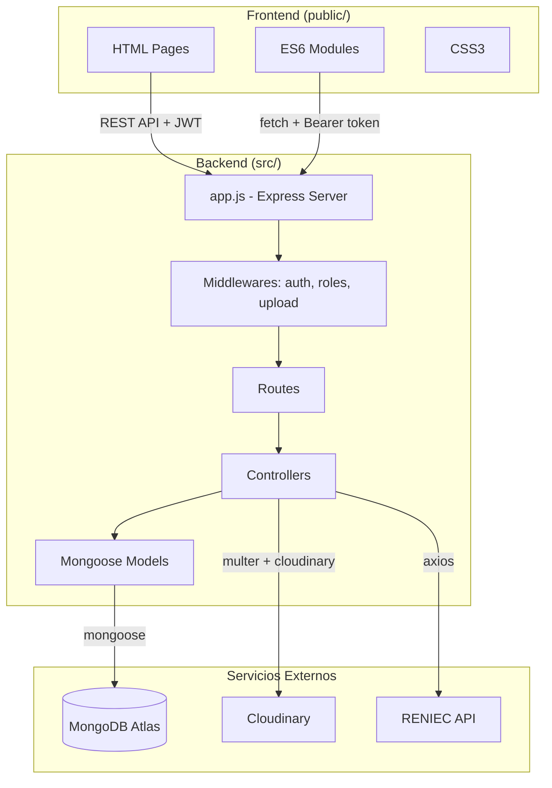
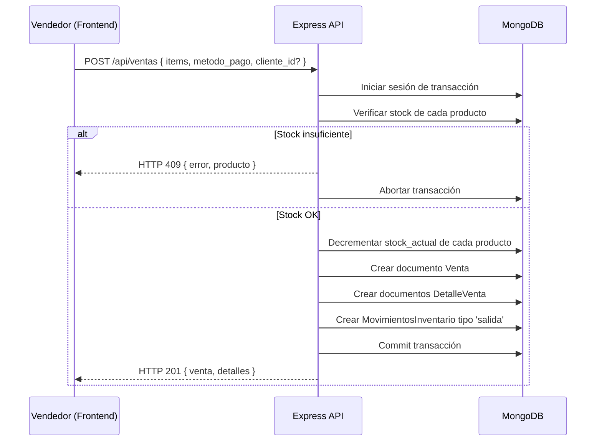
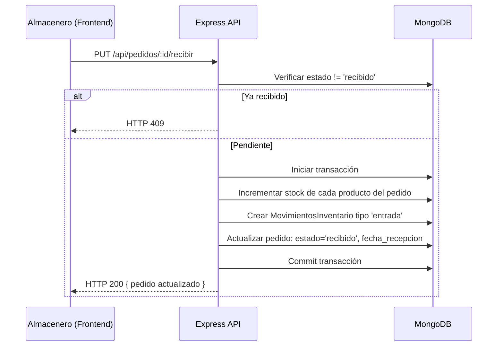

# Documento de Diseño Técnico
## Sistema de Gestión Panta Tec

---

## Visión General

El sistema de gestión Panta Tec es una aplicación web full-stack que migra la arquitectura actual basada en archivos JSON hacia MongoDB Atlas. Cubre ocho módulos funcionales: Dashboard, Productos y Categorías, Punto de Venta (POS), Clientes, Pedidos a Proveedores, Reportes, Usuarios y Configuración. El backend es un servidor Express desplegado directamente (no Netlify Functions), y el frontend usa ES6 Modules sin frameworks.

### Stack Tecnológico

| Capa | Tecnología | Versión |
|------|-----------|---------|
| Runtime | Node.js | ≥ 18 |
| Framework | Express.js | 4.x |
| Base de datos | MongoDB Atlas | 7.x (Mongoose ODM) |
| Autenticación | JWT + bcryptjs | jsonwebtoken 9.x, bcryptjs 2.x |
| Imágenes | Cloudinary SDK | cloudinary 2.x |
| Frontend | HTML + CSS + ES6 Modules | Vanilla JS |
| Rate limiting | express-rate-limit + MongoDB store | - |

---

## Arquitectura

### Diagrama General



### Estructura de Archivos

```
proyecto/
├── .env
├── .env.example
├── package.json
├── server.js                    # Entry point
├── src/
│   ├── app.js                   # Express config, middlewares globales
│   ├── config/
│   │   ├── db.js                # Conexión Mongoose
│   │   └── cloudinary.js        # Config Cloudinary
│   ├── models/
│   │   ├── Usuario.js
│   │   ├── Cliente.js
│   │   ├── Producto.js
│   │   ├── Categoria.js
│   │   ├── Venta.js
│   │   ├── DetalleVenta.js
│   │   ├── MovimientoInventario.js
│   │   ├── Proveedor.js
│   │   ├── Pedido.js
│   │   ├── Configuracion.js
│   │   └── LoginAttempt.js
│   ├── controllers/
│   │   ├── authController.js
│   │   ├── dashboardController.js
│   │   ├── productosController.js
│   │   ├── categoriasController.js
│   │   ├── ventasController.js
│   │   ├── clientesController.js
│   │   ├── proveedoresController.js
│   │   ├── pedidosController.js
│   │   ├── reportesController.js
│   │   ├── usuariosController.js
│   │   └── configuracionController.js
│   ├── routes/
│   │   ├── auth.js
│   │   ├── dashboard.js
│   │   ├── productos.js
│   │   ├── categorias.js
│   │   ├── ventas.js
│   │   ├── clientes.js
│   │   ├── proveedores.js
│   │   ├── pedidos.js
│   │   ├── reportes.js
│   │   ├── usuarios.js
│   │   └── configuracion.js
│   └── middlewares/
│       ├── auth.js              # Verificar JWT
│       ├── roles.js             # Control de acceso por rol
│       └── upload.js            # Multer + Cloudinary
├── scripts/
│   └── migrate.js               # Script de migración JSON → MongoDB
└── public/
    ├── index.html               # Login
    ├── dashboard.html
    ├── css/
    │   ├── style.css
    │   └── pos.css
    └── js/
        ├── api.js               # Wrapper fetch + JWT
        ├── auth.js
        ├── dashboard.js
        └── modules/
            ├── productos.js
            ├── ventas.js
            ├── clientes.js
            ├── pedidos.js
            ├── reportes.js
            ├── usuarios.js
            └── configuracion.js
```

---

## Componentes e Interfaces

### Middlewares

**`src/middlewares/auth.js`**
Verifica el JWT en el header `Authorization: Bearer <token>`. Si el token es inválido o expirado retorna HTTP 401. Adjunta `req.user = { id, usuario, rol }` para uso en controllers.

**`src/middlewares/roles.js`**
Fábrica de middleware que recibe un array de roles permitidos y retorna HTTP 403 si `req.user.rol` no está incluido.

```javascript
// Uso en rutas:
router.get('/reportes', auth, roles(['admin']), reportesController.ventas);
router.post('/productos', auth, roles(['admin', 'almacen']), productosController.crear);
```

**`src/middlewares/upload.js`**
Configura `multer` con almacenamiento en memoria (`memoryStorage`) y límite de 2MB. Acepta solo `image/jpeg`, `image/png` y `image/webp`. Tras la validación, sube el buffer a Cloudinary usando `cloudinary.uploader.upload_stream` y adjunta la URL segura a `req.cloudinaryUrl`.

### Módulo `api.js` (Frontend)

Centraliza todas las llamadas HTTP. Adjunta automáticamente el JWT del `localStorage`. Ante HTTP 401, limpia el storage y redirige a `/index.html`.

```javascript
// Interfaz pública:
api.get(path)
api.post(path, body)
api.put(path, body)
api.patch(path, body)
api.delete(path)
api.postForm(path, formData)   // Para subida de imágenes
```

### Módulo de Rate Limiting

Usa `express-rate-limit` con store en MongoDB (colección `login_attempts`). Configuración: 10 intentos por IP en ventana de 15 minutos. Retorna HTTP 429 al superar el límite.

---

## Modelos de Datos

### `usuarios`

```javascript
{
  _id: ObjectId,
  nombre_completo: { type: String, required: true },
  usuario: { type: String, required: true, unique: true },
  correo: { type: String, required: true, unique: true },
  clave: { type: String, required: true },          // bcryptjs hash, cost 10
  rol: { type: String, enum: ['admin','vendedor','almacen'], required: true },
  activo: { type: Boolean, default: true },
  eliminado: { type: Boolean, default: false },
  fecha_creacion: { type: Date, default: Date.now },
  fecha_actualizacion: { type: Date, default: Date.now }
}
// Índices: usuario (unique), correo (unique)
```

### `clientes`

```javascript
{
  _id: ObjectId,
  dni: { type: String, required: true, unique: true, match: /^\d{8}$/ },
  telefono: { type: String, required: true },
  nombre: String,
  apellido_paterno: String,
  apellido_materno: String,
  email: String,
  direccion: String,
  eliminado: { type: Boolean, default: false },
  fecha_creacion: { type: Date, default: Date.now },
  fecha_actualizacion: { type: Date, default: Date.now }
}
// Índices: dni (unique), nombre + apellido_paterno (text search)
```

### `categorias`

```javascript
{
  _id: ObjectId,
  nombre: { type: String, required: true, unique: true },
  descripcion: String,
  activo: { type: Boolean, default: true }
}
// Índice: nombre (unique)
```

### `productos`

```javascript
{
  _id: ObjectId,
  nombre: { type: String, required: true },
  descripcion: String,
  precio_venta: { type: Number, required: true, min: 0 },
  precio_compra: { type: Number, required: true, min: 0 },
  stock_actual: { type: Number, required: true, min: 0, default: 0 },
  stock_minimo: { type: Number, default: 0, min: 0 },
  categoria_id: { type: ObjectId, ref: 'Categoria', required: true },
  imagen: String,                                   // URL Cloudinary
  estado: { type: String, enum: ['activo','inactivo','agotado'], default: 'activo' },
  eliminado: { type: Boolean, default: false },
  fecha_creacion: { type: Date, default: Date.now },
  fecha_actualizacion: { type: Date, default: Date.now }
}
// Índices: nombre (text), categoria_id, estado, stock_actual
```

### `ventas`

```javascript
{
  _id: ObjectId,
  numero_venta: { type: String, unique: true },     // 'V-2026-001'
  cliente_id: { type: ObjectId, ref: 'Cliente' },   // null = Público general
  vendedor_id: { type: ObjectId, ref: 'Usuario', required: true },
  metodo_pago: { type: String, enum: ['efectivo','tarjeta','yape','plin','transferencia'], required: true },
  subtotal: { type: Number, required: true },
  descuento_tipo: { type: String, enum: ['porcentaje','monto_fijo', null] },
  descuento_valor: { type: Number, default: 0 },
  descuento_total: { type: Number, default: 0 },
  total: { type: Number, required: true },
  monto_recibido: Number,
  vuelto: Number,
  estado: { type: String, enum: ['completada','anulada'], default: 'completada' },
  motivo_anulacion: String,
  fecha_anulacion: Date,
  notas: String,
  fecha_venta: { type: Date, default: Date.now }
}
// Índices: numero_venta (unique), cliente_id, vendedor_id, fecha_venta (-1), estado
```

### `detalle_ventas`

```javascript
{
  _id: ObjectId,
  venta_id: { type: ObjectId, ref: 'Venta', required: true },
  producto_id: { type: ObjectId, ref: 'Producto', required: true },
  cantidad: { type: Number, required: true, min: 1 },
  precio_unitario: { type: Number, required: true },
  descuento_item: { type: Number, default: 0 },
  subtotal: { type: Number, required: true }
}
// Índices: venta_id, producto_id
```

### `movimientos_inventario`

```javascript
{
  _id: ObjectId,
  producto_id: { type: ObjectId, ref: 'Producto', required: true },
  tipo: { type: String, enum: ['entrada','salida','ajuste','devolucion'], required: true },
  cantidad: { type: Number, required: true },
  stock_anterior: { type: Number, required: true },
  stock_nuevo: { type: Number, required: true },
  referencia_id: ObjectId,                          // venta_id o pedido_id
  referencia_tipo: { type: String, enum: ['venta','pedido','ajuste'] },
  usuario_id: { type: ObjectId, ref: 'Usuario', required: true },
  notas: String,
  fecha: { type: Date, default: Date.now }
}
// Índices: producto_id + fecha (-1), referencia_id
```

### `proveedores`

```javascript
{
  _id: ObjectId,
  nombre: { type: String, required: true },
  telefono: { type: String, required: true },
  correo: { type: String, required: true },
  activo: { type: Boolean, default: true },
  fecha_creacion: { type: Date, default: Date.now }
}
```

### `pedidos`

```javascript
{
  _id: ObjectId,
  proveedor_id: { type: ObjectId, ref: 'Proveedor', required: true },
  items: [{
    producto_id: { type: ObjectId, ref: 'Producto', required: true },
    cantidad: { type: Number, required: true, min: 1 }
  }],
  estado: { type: String, enum: ['pendiente','recibido'], default: 'pendiente' },
  usuario_creacion_id: { type: ObjectId, ref: 'Usuario', required: true },
  usuario_recepcion_id: { type: ObjectId, ref: 'Usuario' },
  fecha_creacion: { type: Date, default: Date.now },
  fecha_recepcion: Date
}
// Índices: proveedor_id, estado
```

### `configuracion`

```javascript
{
  _id: ObjectId,
  nombre_tienda: { type: String, required: true },
  ruc: { type: String, required: true, match: /^\d{11}$/ },
  direccion: String,
  telefono: String,
  correo: String
}
// Colección singleton: siempre un solo documento
```

### `login_attempts`

```javascript
{
  _id: ObjectId,
  ip: { type: String, required: true },
  timestamp: { type: Date, default: Date.now }
}
// Índice TTL: timestamp expireAfterSeconds: 900
```

---

## API Endpoints

Todos los endpoints (excepto los marcados como públicos) requieren `Authorization: Bearer <token>`.

### Autenticación

| Método | Ruta | Acceso | Descripción |
|--------|------|--------|-------------|
| POST | `/api/auth/login` | Público | Login, retorna JWT |
| GET | `/api/auth/verificar` | Autenticado | Verifica token activo |

### Dashboard

| Método | Ruta | Acceso | Descripción |
|--------|------|--------|-------------|
| GET | `/api/dashboard` | admin, vendedor | Métricas del día, stock bajo, últimas ventas |

### Categorías

| Método | Ruta | Acceso | Descripción |
|--------|------|--------|-------------|
| GET | `/api/categorias` | Autenticado | Listar categorías activas |
| POST | `/api/categorias` | admin | Crear categoría |
| PUT | `/api/categorias/:id` | admin | Editar categoría |
| DELETE | `/api/categorias/:id` | admin | Eliminar (verifica productos asociados) |

### Productos

| Método | Ruta | Acceso | Descripción |
|--------|------|--------|-------------|
| GET | `/api/productos` | Autenticado | Listar con filtros: `?categoria=&search=&estado=` |
| POST | `/api/productos` | admin, almacen | Crear producto (multipart/form-data con imagen) |
| GET | `/api/productos/:id` | Autenticado | Detalle de producto |
| PUT | `/api/productos/:id` | admin, almacen | Editar producto (multipart/form-data) |
| DELETE | `/api/productos/:id` | admin, almacen | Soft delete |
| GET | `/api/productos/stock-bajo` | Autenticado | Productos con stock ≤ stock_minimo |

### Ventas

| Método | Ruta | Acceso | Descripción |
|--------|------|--------|-------------|
| GET | `/api/ventas` | admin, vendedor | Listar con filtros: `?desde=&hasta=&estado=&metodo_pago=` |
| POST | `/api/ventas` | admin, vendedor | Registrar venta (transacción atómica) |
| GET | `/api/ventas/:id` | admin, vendedor | Detalle con ítems |
| PUT | `/api/ventas/:id/anular` | admin | Anular venta (restaura stock) |

### Clientes

| Método | Ruta | Acceso | Descripción |
|--------|------|--------|-------------|
| GET | `/api/clientes` | admin, vendedor | Listar con filtro: `?search=` |
| POST | `/api/clientes` | admin, vendedor | Crear cliente |
| GET | `/api/clientes/:id` | admin, vendedor | Detalle + historial de ventas |
| PUT | `/api/clientes/:id` | admin, vendedor | Editar cliente |
| DELETE | `/api/clientes/:id` | admin | Soft delete |
| GET | `/api/clientes/dni/:dni` | admin, vendedor | Consulta RENIEC por DNI |

### Proveedores

| Método | Ruta | Acceso | Descripción |
|--------|------|--------|-------------|
| GET | `/api/proveedores` | admin, almacen | Listar proveedores |
| POST | `/api/proveedores` | admin, almacen | Crear proveedor |
| PUT | `/api/proveedores/:id` | admin, almacen | Editar proveedor |

### Pedidos

| Método | Ruta | Acceso | Descripción |
|--------|------|--------|-------------|
| GET | `/api/pedidos` | admin, almacen | Listar con filtros: `?estado=&proveedor_id=` |
| POST | `/api/pedidos` | admin, almacen | Crear pedido |
| PUT | `/api/pedidos/:id/recibir` | admin, almacen | Marcar recibido (transacción atómica) |

### Reportes

| Método | Ruta | Acceso | Descripción |
|--------|------|--------|-------------|
| GET | `/api/reportes/ventas-dia` | admin | `?fecha=YYYY-MM-DD` |
| GET | `/api/reportes/ventas-mes` | admin | `?mes=MM&anio=YYYY` |
| GET | `/api/reportes/productos-mas-vendidos` | admin | `?desde=&hasta=` |
| GET | `/api/reportes/stock-valorizado` | admin | Stock × precio_compra |

### Usuarios

| Método | Ruta | Acceso | Descripción |
|--------|------|--------|-------------|
| GET | `/api/usuarios` | admin | Listar usuarios |
| POST | `/api/usuarios` | admin | Crear usuario |
| PUT | `/api/usuarios/:id` | admin | Editar nombre, correo, rol |
| PATCH | `/api/usuarios/:id/estado` | admin | Activar/desactivar |
| DELETE | `/api/usuarios/:id` | admin | Soft delete |

### Configuración

| Método | Ruta | Acceso | Descripción |
|--------|------|--------|-------------|
| GET | `/api/configuracion/publica` | Público | Nombre y datos básicos de la tienda |
| GET | `/api/configuracion` | admin | Datos completos |
| PUT | `/api/configuracion` | admin | Guardar/editar configuración |

---

## Flujos Principales

### Flujo de Venta (POS)



### Flujo de Recepción de Pedido



### Flujo de Subida de Imagen de Producto

```
1. Frontend envía multipart/form-data al POST /api/productos
2. Middleware upload.js (multer memoryStorage) valida tipo y tamaño
3. Si válido: sube buffer a Cloudinary → obtiene secure_url
4. Controller recibe req.cloudinaryUrl y lo guarda en producto.imagen
5. Si Cloudinary falla: retorna HTTP 500, no crea el producto
```

### Flujo de Consulta RENIEC

```
1. Frontend llama GET /api/clientes/dni/:dni
2. Controller hace GET a RENIEC_API_URL con header RENIEC_API_KEY
3. Si respuesta OK: retorna { nombre, apellido_paterno, apellido_materno }
4. Si error RENIEC (timeout, 404, 500): retorna HTTP 200 con { encontrado: false, mensaje }
   → El frontend muestra aviso y permite ingreso manual
```

---

## Script de Migración

El script `scripts/migrate.js` lee los cuatro archivos JSON del sistema actual e inserta los documentos en MongoDB. Se ejecuta una sola vez con `node scripts/migrate.js`.

### Estrategia de Mapeo

**`data/categorias.json` → colección `categorias`**
- Genera nuevo `_id` ObjectId
- Guarda mapeo `{ id_json: ObjectId }` en memoria para referencias cruzadas
- Usa `nombre` del campo `nombreMostrar` (capitalizado)

**`data/productos.json` → colección `productos`**
- Genera nuevo `_id` ObjectId
- Resuelve `categoria_id` usando el mapeo de categorías por nombre
- `precio_venta` ← `precio`; `precio_compra` ← 0 (desconocido en JSON)
- `stock_actual` ← `stock`; `stock_minimo` ← 0
- `estado` ← `'activo'` si `stock > 0`, `'agotado'` si `stock === 0`
- Guarda mapeo `{ id_json: ObjectId }` para referencias cruzadas

**`data/ventas.json` → colección `ventas`**
- Genera nuevo `_id` ObjectId y `numero_venta` secuencial (`V-MIGR-001`)
- `cliente_id` ← null (los nombres de cliente en JSON no tienen DNI)
- `vendedor_id` ← ObjectId del primer usuario admin creado
- `fecha_venta` ← `fecha`
- Guarda mapeo `{ id_json: ObjectId }`

**`data/detalles_venta.json` → colección `detalle_ventas`**
- Resuelve `venta_id` y `producto_id` usando los mapeos anteriores
- `subtotal` ← `cantidad × precio_unitario` (campo ausente en JSON original)
- `descuento_item` ← 0

### Manejo de Errores en Migración

- Cada registro se procesa en un bloque `try/catch` individual
- Registros problemáticos se escriben en `scripts/migration-errors.log` con formato:
  ```
  [TIMESTAMP] [COLECCIÓN] id_json=X error=<mensaje>
  ```
- La migración continúa con los demás registros sin interrumpirse
- Al finalizar imprime resumen: `{ migrados, errores }` por colección

### Verificación Round-Trip

Tras insertar cada lote, el script lee de vuelta los documentos insertados y verifica que el conteo coincida con los registros del JSON fuente. Si hay discrepancia, lo registra en el log de errores.

```javascript
// Ejemplo de verificación:
const insertados = await Producto.countDocuments({ _id: { $in: idsInsertados } });
if (insertados !== productosJSON.length - errores) {
  log.error(`Round-trip mismatch: esperados ${productosJSON.length - errores}, encontrados ${insertados}`);
}
```

---

## Manejo de Errores

### Códigos HTTP Estándar

| Código | Situación |
|--------|-----------|
| 400 | Validación fallida (campo requerido, formato inválido) |
| 401 | JWT ausente, expirado o inválido; cuenta inactiva |
| 403 | Rol sin permisos para el endpoint |
| 404 | Recurso no encontrado |
| 409 | Conflicto: duplicado, stock insuficiente, estado inválido |
| 413 | Imagen supera 2MB |
| 415 | Tipo de archivo no permitido |
| 429 | Rate limit superado |
| 500 | Error interno del servidor |

### Formato de Respuesta de Error

```json
{
  "error": "Mensaje descriptivo en español",
  "campo": "nombre_campo"   // opcional, para errores de validación
}
```

### Errores Específicos por Módulo

**Auth:** Los errores 401 de credenciales incorrectas no revelan si el usuario existe (`"Credenciales inválidas"`).

**Ventas (transacción):** Si la transacción MongoDB falla en cualquier paso, se hace rollback completo. El cliente recibe HTTP 409 con el nombre del producto que causó el fallo de stock, o HTTP 500 para errores de infraestructura.

**Cloudinary:** Si la subida falla, el producto no se crea/actualiza. Se retorna HTTP 500 con mensaje `"Error al subir imagen"`.

**RENIEC API:** Los errores de la API externa (timeout, 4xx, 5xx) se capturan y se retorna HTTP 200 con `{ encontrado: false }` para no bloquear el flujo del usuario.

**Último admin activo:** Si se intenta desactivar o eliminar al último usuario con `rol: 'admin'` y `activo: true`, retorna HTTP 409 con `"No se puede desactivar al último administrador activo"`.

### Variables de Entorno Requeridas

```env
# MongoDB
MONGODB_URI=mongodb+srv://...

# JWT
JWT_SECRET=cadena_aleatoria_minimo_32_caracteres

# Cloudinary
CLOUDINARY_CLOUD_NAME=
CLOUDINARY_API_KEY=
CLOUDINARY_API_SECRET=

# RENIEC
RENIEC_API_URL=
RENIEC_API_KEY=

# Servidor
PORT=3000
NODE_ENV=production
ALLOWED_ORIGINS=http://localhost:3000
```

---

## Propiedades de Corrección

*Una propiedad es una característica o comportamiento que debe mantenerse verdadero en todas las ejecuciones válidas del sistema — esencialmente, una declaración formal sobre lo que el sistema debe hacer. Las propiedades sirven como puente entre las especificaciones legibles por humanos y las garantías de corrección verificables por máquina.*

### Propiedad 1: Autenticación con credenciales válidas genera JWT

*Para cualquier* usuario activo en el sistema, al enviar sus credenciales correctas al endpoint de login, el sistema debe retornar un JWT que contenga el identificador del usuario, su nombre de usuario y su rol, y que sea válido por exactamente 8 horas.

**Valida: Requisito 1.1**

### Propiedad 2: Rate limiting bloquea intentos excesivos

*Para cualquier* dirección IP, si realiza más de 10 intentos de login fallidos en una ventana de 15 minutos, todos los intentos subsiguientes dentro de esa ventana deben retornar HTTP 429.

**Valida: Requisito 1.3**

### Propiedad 3: Control de acceso por rol es exhaustivo

*Para cualquier* endpoint protegido y cualquier usuario autenticado, si el rol del usuario no está en la lista de roles permitidos del endpoint, el sistema debe retornar HTTP 403 sin ejecutar la lógica del controlador.

**Valida: Requisitos 1.6, 1.7**

### Propiedad 4: Métricas del dashboard reflejan solo ventas completadas del día

*Para cualquier* conjunto de ventas en la base de datos, el total de ingresos mostrado en el Dashboard debe ser igual a la suma de los campos `total` de las ventas con `estado: 'completada'` y `fecha_venta` dentro del día en curso, sin incluir ventas anuladas ni de otros días.

**Valida: Requisito 2.2**

### Propiedad 5: Stock bajo detectado correctamente

*Para cualquier* producto en el catálogo, si su `stock_actual` es menor o igual a su `stock_minimo`, el endpoint de stock bajo debe incluir ese producto en su respuesta; y si `stock_actual > stock_minimo`, el producto no debe aparecer en esa respuesta.

**Valida: Requisitos 2.3, 4.7, 4.9**

### Propiedad 6: Registro de venta descuenta stock atómicamente

*Para cualquier* venta válida con N ítems, tras el registro exitoso, el `stock_actual` de cada producto involucrado debe haber disminuido exactamente en la cantidad vendida, y deben existir exactamente N documentos `MovimientoInventario` de tipo `salida` referenciando esa venta.

**Valida: Requisitos 5.10, 5.12, 11.1**

### Propiedad 7: Anulación de venta restaura stock completamente

*Para cualquier* venta con estado `completada`, al anularla, el `stock_actual` de cada producto involucrado debe quedar igual al valor que tenía antes de la venta, y deben existir documentos `MovimientoInventario` de tipo `devolucion` por cada ítem.

**Valida: Requisitos 5.15, 5.17**

### Propiedad 8: Cálculo de descuento es correcto y seguro

*Para cualquier* venta con descuento de tipo `porcentaje`, el campo `descuento_total` debe ser igual a `round(subtotal × (descuento_valor / 100), 2)`. *Para cualquier* venta con descuento de tipo `monto_fijo`, el `descuento_total` no debe superar el `subtotal`.

**Valida: Requisitos 5.6, 5.7**

### Propiedad 9: DNI de cliente es único en el sistema

*Para cualquier* intento de crear un cliente con un DNI que ya existe en la colección `clientes` (con `eliminado: false`), el sistema debe retornar HTTP 409 y no crear un segundo documento con ese DNI.

**Valida: Requisito 6.2**

### Propiedad 10: Recepción de pedido incrementa stock atómicamente

*Para cualquier* pedido con estado `pendiente` que contiene M ítems, al marcarlo como `recibido`, el `stock_actual` de cada producto debe incrementarse exactamente en la cantidad del pedido, y deben existir M documentos `MovimientoInventario` de tipo `entrada` referenciando ese pedido.

**Valida: Requisitos 7.5, 7.6, 11.2**

### Propiedad 11: Migración preserva todos los registros (round-trip)

*Para cualquier* conjunto de registros en los archivos JSON fuente, tras ejecutar el script de migración, el conteo de documentos en cada colección MongoDB debe ser igual al número de registros válidos del JSON correspondiente, y cada documento debe poder ser leído y deserializado correctamente desde MongoDB.

**Valida: Requisitos 11.3, 11.5**

### Propiedad 12: Validación de RUC es estricta

*Para cualquier* intento de guardar la configuración de la tienda, si el campo `ruc` no contiene exactamente 11 dígitos numéricos, el sistema debe retornar HTTP 400 y no persistir el documento.

**Valida: Requisitos 10.2, 10.3**

### Propiedad 13: Contraseñas siempre almacenadas como hash

*Para cualquier* usuario creado o con contraseña actualizada, el campo `clave` almacenado en MongoDB nunca debe ser igual al texto plano de la contraseña ingresada, y debe ser verificable con `bcryptjs.compare`.

**Valida: Requisitos 1.8, 9.2**

### Propiedad 14: Último admin activo protegido

*Para cualquier* operación de desactivación o eliminación de usuario, si el usuario objetivo es el único con `rol: 'admin'` y `activo: true` en el sistema, la operación debe retornar HTTP 409 y no modificar el documento.

**Valida: Requisito 9.9**

---

## Estrategia de Testing

### Enfoque Dual

El proyecto usa dos tipos de tests complementarios:

- **Tests unitarios/integración**: verifican ejemplos concretos, casos borde y condiciones de error
- **Tests de propiedades (PBT)**: verifican propiedades universales sobre rangos amplios de entradas generadas

Librería PBT seleccionada: **`fast-check`** (compatible con Node.js/Jest, ampliamente mantenida).

### Tests Unitarios e Integración

Herramienta: **Jest** + **supertest** para endpoints HTTP.

Cobertura prioritaria:
- Middleware de autenticación: token válido, expirado, ausente
- Middleware de roles: cada combinación rol/endpoint
- Controller de ventas: registro exitoso, stock insuficiente, anulación
- Controller de pedidos: recepción exitosa, pedido ya recibido
- Validaciones de modelos Mongoose: DNI 8 dígitos, RUC 11 dígitos
- Script de migración: mapeo correcto, manejo de registros inválidos
- Consulta RENIEC: respuesta exitosa, timeout, error 404

### Tests de Propiedades (PBT)

Cada test de propiedad debe ejecutarse con mínimo **100 iteraciones**. Cada test incluye un comentario de trazabilidad:

```javascript
// Feature: sistema-celulares-pantaTec, Property N: <texto de la propiedad>
```

**Propiedad 2 — Rate limiting:**
```javascript
// Feature: sistema-celulares-pantaTec, Property 2: Rate limiting bloquea intentos excesivos
fc.assert(fc.asyncProperty(
  fc.ipV4(),
  async (ip) => {
    // Generar 11 intentos fallidos desde la misma IP
    // Verificar que el intento 11 retorna 429
  }
), { numRuns: 100 });
```

**Propiedad 3 — Control de acceso:**
```javascript
// Feature: sistema-celulares-pantaTec, Property 3: Control de acceso por rol es exhaustivo
fc.assert(fc.asyncProperty(
  fc.record({ rol: fc.constantFrom('vendedor', 'almacen'), endpoint: fc.constantFrom(...endpointsAdmin) }),
  async ({ rol, endpoint }) => {
    const res = await request(app).get(endpoint).set('Authorization', tokenFor(rol));
    return res.status === 403;
  }
), { numRuns: 100 });
```

**Propiedad 6 — Registro de venta atómico:**
```javascript
// Feature: sistema-celulares-pantaTec, Property 6: Registro de venta descuenta stock atómicamente
fc.assert(fc.asyncProperty(
  fc.array(fc.record({ producto_id: fc.string(), cantidad: fc.integer({ min: 1, max: 5 }) }), { minLength: 1, maxLength: 5 }),
  async (items) => {
    // Crear productos con stock suficiente
    // Registrar venta
    // Verificar stock decrementado y movimientos creados
  }
), { numRuns: 100 });
```

**Propiedad 8 — Cálculo de descuento:**
```javascript
// Feature: sistema-celulares-pantaTec, Property 8: Cálculo de descuento es correcto y seguro
fc.assert(fc.property(
  fc.float({ min: 0.01, max: 10000 }),
  fc.float({ min: 0, max: 100 }),
  (subtotal, porcentaje) => {
    const descuento = calcularDescuento('porcentaje', subtotal, porcentaje);
    return Math.abs(descuento - Math.round(subtotal * (porcentaje / 100) * 100) / 100) < 0.001;
  }
), { numRuns: 500 });
```

**Propiedad 11 — Migración round-trip:**
```javascript
// Feature: sistema-celulares-pantaTec, Property 11: Migración preserva todos los registros
fc.assert(fc.asyncProperty(
  fc.array(productoArbitrario(), { minLength: 1, maxLength: 50 }),
  async (productosJSON) => {
    await migrarProductos(productosJSON);
    const count = await Producto.countDocuments();
    return count === productosJSON.length;
  }
), { numRuns: 100 });
```

### Casos Borde Prioritarios (Tests Unitarios)

- Venta con carrito de un solo ítem
- Venta con stock exactamente igual a la cantidad solicitada (límite)
- Descuento de monto fijo igual al subtotal (total = 0)
- DNI con exactamente 8 dígitos vs 7 y 9 dígitos
- RUC con exactamente 11 dígitos vs 10 y 12
- Migración con archivo JSON vacío `[]`
- Migración con registro que tiene `producto_id` inexistente en el mapeo
- Desactivar al penúltimo admin (debe permitirse)
- Desactivar al último admin (debe rechazarse)
